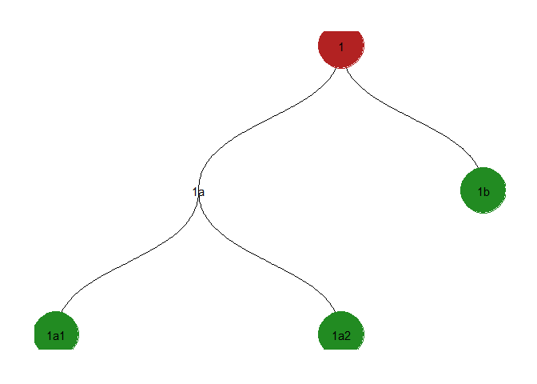

<!-- README.md is generated from README.Rmd. Please edit that file -->

# nestedcats

<!-- badges: start -->

<!-- badges: end -->

This package aims to make it possible to store and manipulate rich
hierarchical category information and do split-apply-combine operations
on these categories.

## Installation

You can install the development version from
[GitHub](https://github.com/) with:

``` r
# install.packages("devtools")
devtools::install_github("jameelalsalam/nestedcats")
```

## Example

This is a basic example which shows you how to solve a common problem:

Suppose you have information about a tree of nested categories. This
package takes the approach of representing this as a `tbl_graph` from
the `tidygraph` package.

``` r

suppressPackageStartupMessages(library(tidyverse))
suppressPackageStartupMessages(library(tidygraph))
suppressPackageStartupMessages(library(ggraph))

library(nestedcats)

cats <- tibble(name = c("1", "1a", "1a1", "1a2", "1b"))

cat_tree <- tibble::tibble(
  parent = c("1", "1", "1a", "1a"),
  child =  c("1a", "1b", "1a1", "1a2")
)

cat_g <- tbl_graph(cats, cat_tree)

viz_cats_ggraph_tree(cat_g)
```



And further suppose you have information about the leaf nodes.

``` r

leaf_data <- tibble(
  cat = c("1b", "1a1", "1a2"),
  value = c(1, 2, 3)
)
```

cat\_tree \<- tibble::tibble( parent = c(NA\_character, “1”, “1”, “1a”,
“1a”), child = c(“1”, “1a”, “1b”, “1a1”, “1a2”) ) %\>%
as\_closure\_tbl()

leaf\_data %\>% group\_by\_cats(cat = c(“1a”, “1b”), along = cat\_tree)
%\>% summarize(value = sum(value, na.rm = TRUE))

verify\_covers(c(“1a”, “1b”), over = cat\_tree) verify\_disjoint(c(“1a”,
“1b”), along = cat\_tree) verify\_disjoint\_covers(c(“1a”, “1b”), along
= cat\_tree)

all.equal(coverage(c(“1a”, “1b”), along = cat\_tree), coverage(“1”,
along = cat\_tree))
